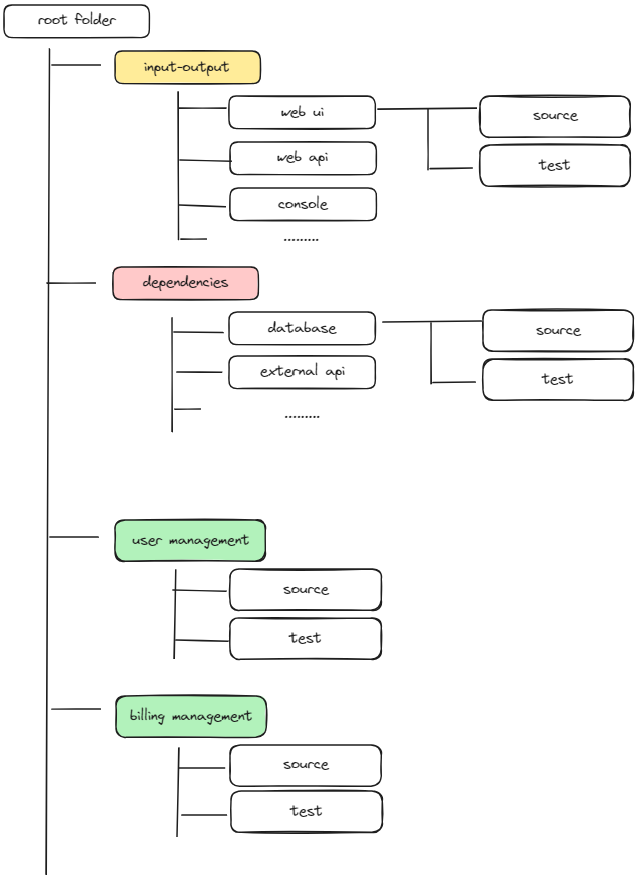

+++
title = 'Applying First Principle to Source code Structure'
date = 2024-03-30T08:01:42+07:00
draft = false
+++
## Why
Sometimes, we're in a scenario where we need to create software without clear specification and are expected to evolve as time goes. It's a challenging scenario because there’s high risk of the volatility of the specification that could lead us to unordered and multi patchwork source code that are hard to reason with.
There is no cure for this kind of scenario, meaning we cannot totally remove all the risks that might lead us to rewrite / majorly rework our software from scratch. But there’s a way for us to prolong the lifetime of the source code before it needs to be rewrite, and that is applying The First Principle of source code structure.
The benefit is that changes can be contained within the smallest possible part, saving time and the cost of implementing those changes.

## How
First we analyze software for what it really is, then propose the source code structure based on our findings.

### Analyze
Software in this scope in essence is a program running on general OS like Linux or Windows. In its core, a computation logic exists as the reason for the existence of the software itself. Looking at the perspective of source code, this logic is implemented using programming languages used, and the computation runs by receiving data as input in the form of type/struct/class depending on the language paradigm. It then does some computation and resulting data as output that are also in the form of type/struct/class. In this article hence, this will be named **Logic Layer**.

Even most of the simplest form of software, more often than not, receives some kind of input from outside it, be it human or another software, and showing its output to anything that needs it. Since we established that Logic Layer receive type/struct/class, input from outside can’t be only that, and output from it also might not be enough as an output, thus we need to introduce a new layer for each, called Input Layer and Output Layer. But from the experience of developing desktop, mobile, web frontend and web backend development, it’s safe to assume that those two layers merge into one called Input/Output Layer.

The dependency layer is quite broad compared to others because it can encompass many things, depending on where the software runs. For a backend application, a database or cache engine are prominent examples of its dependencies. For a web app, local storage or a server API are examples of its dependencies. For Android, the phone's features or a server API are examples of its dependencies.

### Structure Proposal
Now we have three type of layers, We now can use it as a guiding principle on how our source code structure should be:

Image that we want to build a SaaS app using this principle, then source code structure could be as follow:

1. In root folder, we will have many subfolder that falls into one of 3 category
1. Logic folder. Represented by green color in above diagram, it's a class library packages that have no dependencies 
1. Dependencies folder. Represented by red color, example of this is a package is database packages
1. Input/Output folder. Represented by yellow, an example for this is a web framework that is being used.

This is just a baseline for getting started, by no means the end result of a complex software. For example, we might need to introduce `Common` folder so there will no cyclic dependencies between Logic folders.

## Afterthought
Looking at the proposed structure, it's strikingly similar to the core concepts of Hexagonal Architecture, Onion Architecture, and Clean Architecture. These architectural terms have been received with mixed reactions in the software community, in my opinion, mainly because their overuse leads to overly complex source code. Logically thinking, the structure proposed above is also prone to overuse, and ultimately, the wisdom of trade-offs should come into play when applying it.