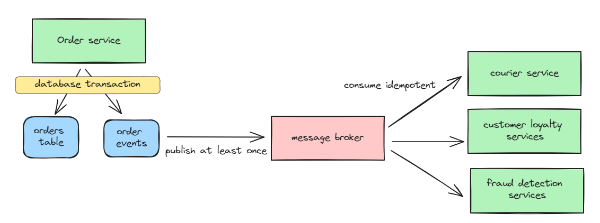
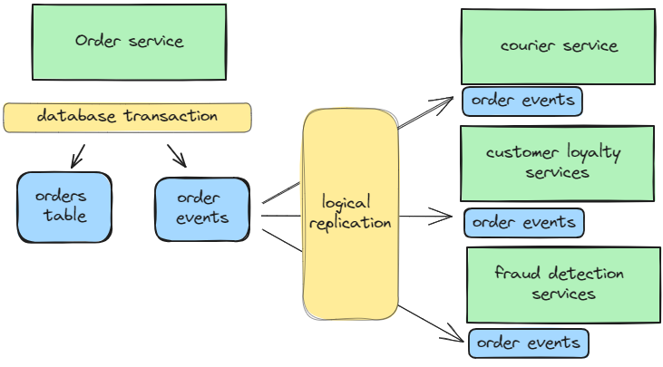

+++
title = 'Ditch the Message Broker: Microservices the Right Way with This One Game-Changing Strategy'
date = 2023-11-09T23:01:42+07:00
draft = false
+++
## The Importance of the Outbox Pattern in Microservices The Right Way
Implementing microservices the right way involves adopting event-driven microservices, as we cannot rely solely on API calls to share data. Relying on such calls can trap us in a distributed monolith, where services become overly tightly coupled.

Any significant system that implements event-driven microservices will, at some point (though often too late from what I see), implement the [outbox pattern](https://microservices.io/patterns/data/transactional-outbox.html) because it ensures data consistency across services. Without it, data inconsistencies can occur and are really hard to debug.

## Conventional Implementation

The conventional way of implementing the outbox pattern involves a service that, while conducting its database transactions and generating events to be published, stores these events in an outbox table. Processes are then put in place to read from this table and send the data to a message broker using an "at-least-once" approach.

Later on, services needing to consume these events will subscribe to them in an idempotent manner, as some messages might be duplicated. This approach ensures data integrity, even if it results in eventual consistency.

## The Game Changer
Now, enter the game-changer: [PostgreSQL logical replication](https://www.postgresql.org/docs/16/logical-replication.html). This built-in feature in PostgreSQL enables us to replicate data from a source database to multiple target databases, essentially following a publisher-subscribers model.

Moreover, it also offers the capability to filter rows and columns, allowing us to configure and tailor the data we wish to replicate. It's a pity that I only came across this feature today, but it's still a joy to discover that PostgreSQL has this capability.

## Logically Replicate The Outbox Table

Using logical replication, we can now bypass the message broker. We simply insert events into the outbox table, and consumers can replicate this table, accessing all the data locally. There's no need to worry about "at-least-once" delivery or idempotency, as the data will eventually be available. Such simplicity.

The caveat is that the source and target table names must be the same. Therefore, we might want to designate specific table names for each service. For example, `order_service.order_events` should be exclusively owned (with read-write access) by the Order Service, while others may only have read access. This enforcement is not implemented at the system level but through conventions agreed upon across teams.

## Conclusion
Implementing microservices correctly means favoring asynchronous communication over synchronous, primarily through event-driven data transfer. The outbox pattern is essential for publishing events consistently, and typically, a message broker is necessary for its implementation. Fortunately, PostgreSQL logical replication can now facilitate event-driven approaches without the need for a message broker, tremendously simplifying and easing the implementation of the outbox pattern.

## Discussion
Further discussion for this post can be [continued on X (previously known as Twitter)](https://x.com/riza_ramadan/status/1724311374740996576)
