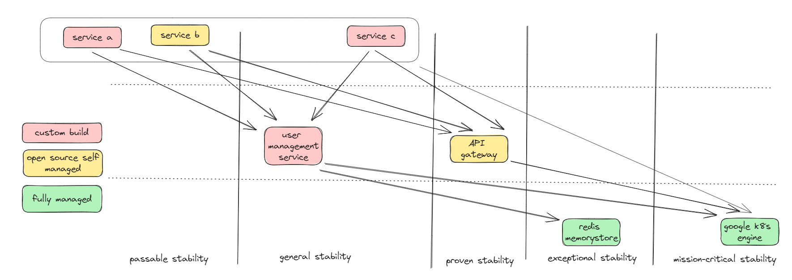

+++
title = 'Visualizing Web App Dependencies and Stability With Runtime Dependencies Map'
date = 2023-10-23T15:02:32+07:00
draft = false
+++
Let's just say that to sustain, we need to improve. And to improve, we essentially need to move. When we talk about movement in the real world, what tool is most commonly used to navigate from one place to another? A map. A map offers a model that provides information about the landscape we are in. It helps us clearly understand our current location, our destination, and the route to get there. And *Runtime Dependencies Map* will have help that, in context of the stability of our web app.

But what do we mean about "runtime dependencies"? As we should be aware, our web application generates values when it runs, and maintaining its stability is paramount. It's important to note that this isn't as straightforward as it may seem; numerous issues can arise. More often than not, these problems stem from uncontrolled dependencies. Therefore, the Runtime Dependencies Map serves as a guide to understanding our current standing with our services and dependencies, greatly aiding us in determining areas for improvement and our ultimate goals.

Runtime dependencies map is inspired by [Wardley Mapping](https://learnwardleymapping.com)

## What is Runtime Dependencies Map
A map is essentially a diagram in which every location has significance. Consider a Cartesian plane; it can be regarded as a map, whereas a mind map cannot, so we need to have meaning in both X-Axis movement and Y-Axis movement. In the Runtime Dependencies Map:
- On the X-Axis, movement up and down represents changes in the system's dependencies. The upper sections indicate more direct dependencies, while the lower sections suggest deeper dependencies.
- On the Y-Axis, movement from left to right represents shifts in stability. We propose five stages of stability:
    - passable stability : Extensive tests have deemed it acceptable for launch
    - general stability: 98% uptime over the past 3 months.
    - proven stability: 99% uptime over the past 3 months.
    - exceptional stability: 99.9% uptime over the past 6 months.
    - mission-critical stability: 99,99% uptime over the past year.
In addition to XY movement, we also use color to indicate the origin of the dependencies. We propose three different colors: red for custom builds, yellow for open-source solutions that we manage ourselves, and green for fully managed services that we use.

## Example 
Lets take a look at map below:

1. Dependencies Depth (X-Axis):
    1. Upper Section (Direct Dependencies): Service A, Service B, and Service C are top-level services in the system.They directly depend on other services in the middle and lower sections.
    1. Mid Section (Intermediate Dependencies):
        1. User Management Service: Manages user-related functionalities. Service A, Service B, and Service C depend on this service.
        1. API Gateway: Handles incoming API requests, routing them to the appropriate services. Service A, Service B, and Service C also depend on this service.
    1. Lower Section (Deeper Dependencies):
        1. Redis Memorystore: An in-memory data store. The API Gateway has a dependency on this component.
        1. Google K8s Engine (GKE): The Kubernetes management service provided by Google. The API Gateway and those three Services in upper section also depends on this service.

1. Stability (Y-Axis):
    1. Passable Stability: Service A and Service b currently in this section, demonstrating both custom build and open source that we self managed can be in the same Y-Axis section
    1. General Stability: User Management Service is positioned here, indicating it has achieved 98% uptime over the past 3 months.
    1. Proven Stability: API Gateway resides in this stability bracket, suggesting a 99% uptime over the past 3 months.
    1. Exceptional Stability: Redis Memorystore is situated here, indicating 99.9% uptime over the past 6 months.
    1. Mission-Critical Stability: Google K8s Engine (GKE) is in this section, highlighting a strong 99.99% uptime over the past year.

### "That is a map okay... so what?"
The map provides a clear understanding of how services interact and their respective stabilities. With this kind of visualization, it won't be long before someone initiates a discussion on aspects that may not be ideal in the current situation. Looking at the map example above, all those services depend on the user management service. Thus, it only makes sense that these three services cannot achieve proven stability if one of their dependencies, the user management service, is still at general stability. If we aim to move service C to the proven stability section, then we have two options:
- Improve the user management service so it can be placed in the proven stability section.
- Ensure that service C no longer depends on the user management service.
Such a visualization will exponentially increase the effectiveness and objectivity of web app architecture discussions.

## Why is it important?
The Runtime Dependencies Map is important for several reasons:
1. Visibility & Transparency: It provides stakeholders with a visual representation of how different services and components are interconnected. This aids in understanding the complexity and intricacy of the system.
1. Informed Decision Making: When considering changes, upgrades, or decommissions, understanding dependencies ensures that decisions are made with full knowledge of potential ripple effects.
1. Facilitates Communication: A visual representation is often easier to understand than lengthy technical explanations. This map can serve as a discussion starter among different teams, ensuring everyone is on the same page.
1. Planning & Prioritization: When planning new features, updates, or maintenance, understanding the dependencies helps in prioritizing tasks based on their potential impact on the system.
In essence, a Runtime Dependencies Map acts as a crucial tool in software architecture and system management, providing a holistic view of the system's interconnections and stabilities, thereby guiding informed decision-making.