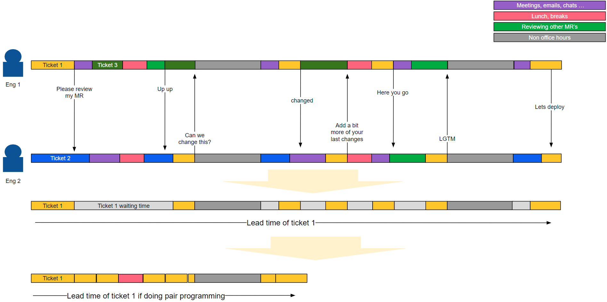

+++
title = 'Why Pair or Mob Programming Worth The Cost in an Effectively Prioritized Setting'
date = 2023-11-01T23:01:42+07:00
draft = false
+++
Lead time in software development is the duration from when a task is initiated until it's deployed. It's an essential measure of productivity, with shorter lead times implying higher efficiency. Effective prioritization is crucial in achieving this, especially in a pair programming environment.

Pair programming thrives in an environment where tasks are appropriately prioritized. This is because having two minds focused on high-priority tasks leads to their swift and accurate completion, hence shorter lead times. However, without effective prioritization, the cost-to-benefit ratio could diminish since two developers could be tied up with tasks that are not immediate or important.

# Mandatory Prerequisite
1. Work is prioritized, ensuring there are no two tasks with the same priority.
1. Have a clearly defined goal for pairing or mobbing. Before any pairing or mobbing starts, we already have specific and clear written goals.

# Illustration
Let's illustrate this:

Assuming the information in the above image is accurate (as it often might be), if Ticket 1 is being worked on asynchronously by Engineer 1 and Engineer 2, it will be deployed on the third day. However, pair programming will result in its deployment on the second day. The rationale is: if Ticket 1 is the most important task, why delay it by even one day? It's certainly beneficial to complete Ticket 1 earlier. Conversely, if Ticket 1 isn't the most important task, why work on it at all?

So, it's highly recommended to engage in pair or mob programming in that kind of setting or work environment.
